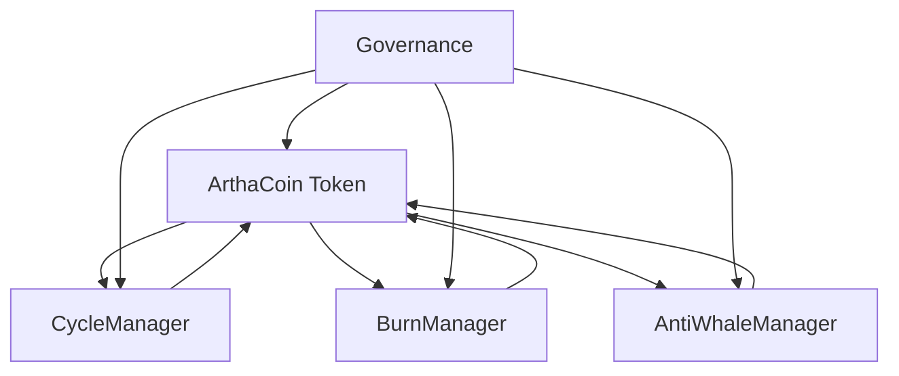

# 🪙 ArthaCoin (ARTHA) - Advanced Tokenomics System

**Production-ready Layer 1 native token with sophisticated emission cycles, burn mechanics, and anti-whale protection.**

## 🎯 **Key Features**

### ⚡ **Advanced Tokenomics**
- **Zero Initial Supply**: Starts from genesis, all tokens minted through emission cycles
- **3-Year Emission Cycles**: Starting at 50M ARTHA, increasing 5% each cycle until year 30
- **Progressive Burn**: 40% → 96% burn rate over 17+ years on transfers
- **Multi-Pool Allocation**: Automatic distribution to 7 different pools
- **Anti-Whale Protection**: Max 1.5% holding, 0.5% transfer limits

### 🛡️ **Security & Governance**
- **Fully Upgradeable**: UUPS proxy pattern with role-based access control
- **Modular Architecture**: Separate contracts for different functionalities
- **Emergency Controls**: Governance can override parameters in emergencies
- **Formal Verification Ready**: Clean, auditable code structure

### 🔄 **Emission Schedule**

| Cycle | Years | Amount (ARTHA) | Increase |
|-------|-------|----------------|----------|
| 0 | 1-3 | 50,000,000 | - |
| 1 | 4-6 | 52,500,000 | +5% |
| 2 | 7-9 | 55,125,000 | +5% |
| ... | ... | ... | +5% |
| 10+ | 30+ | 129,093,000 | Fixed |

### 🔥 **Burn Rate Schedule**

| Years | Burn Rate | Purpose |
|-------|-----------|---------|
| 1-2 | 40% | Moderate deflation |
| 3-4 | 47% | Increasing scarcity |
| 5-6 | 54% | Progressive burn |
| 7-8 | 61% | Accelerating deflation |
| 9-10 | 68% | Strong burn |
| 11-12 | 75% | High deflation |
| 13-14 | 82% | Very high burn |
| 15-16 | 89% | Extreme deflation |
| 17+ | 96% | Maximum burn |

### 💰 **Allocation Per Cycle**

- **45%** → Validators Pool
- **20%** → Staking Rewards Pool
- **10%** → Ecosystem Grants Pool
- **10%** → Marketing & Growth Wallet
- **5%** → Developers & Contributors Pool
- **5%** → DAO Governance Pool
- **5%** → Treasury Reserve

## 🏗️ **Architecture**

### 📋 **Contract Overview**

```
🏛️ ArthaCoin Ecosystem:
├── 🪙 ArthaCoin.sol (Main ERC20 token)
├── 🔄 CycleManager.sol (Emission cycles)
├── 🔥 BurnManager.sol (Progressive burn rates)
├── 🐋 AntiWhaleManager.sol (Transfer/holding limits)
└── 🚀 ArthaCoinDeployment.sol (Deployment script)
```

### 🔗 **Contract Interactions**



## 🚀 **Deployment Guide**

### 📋 **Prerequisites**

```bash
npm install @openzeppelin/contracts-upgradeable
npm install @openzeppelin/contracts
```

### 🛠️ **Deployment Steps**

1. **Prepare Pool Addresses**:
```solidity
ArthaCoinDeployment.PoolAddresses memory pools = ArthaCoinDeployment.PoolAddresses({
    validatorsPool: 0x...,        // Validator rewards
    stakingRewardsPool: 0x...,    // Staking rewards
    ecosystemGrantsPool: 0x...,   // Ecosystem grants
    marketingWallet: 0x...,       // Marketing funds
    developersPool: 0x...,        // Developer rewards
    daoGovernancePool: 0x...,     // DAO governance
    treasuryReserve: 0x...        // Treasury reserve
});
```

2. **Deploy Complete System**:
```solidity
ArthaCoinDeployment deployer = new ArthaCoinDeployment();
ArthaCoinDeployment.DeploymentAddresses memory addresses = deployer.deployComplete(
    adminAddress,
    pools
);
```

3. **Verify Deployment**:
```solidity
bool success = deployer.verifyDeployment(addresses);
require(success, "Deployment verification failed");
```

### 📝 **Example Deployment Script**

```javascript
const { ethers, upgrades } = require("hardhat");

async function main() {
    const [deployer] = await ethers.getSigners();
    console.log("Deploying with account:", deployer.address);

    // Deploy the deployment contract
    const ArthaCoinDeployment = await ethers.getContractFactory("ArthaCoinDeployment");
    const deployment = await ArthaCoinDeployment.deploy();
    await deployment.deployed();

    // Prepare pool addresses (replace with real addresses)
    const pools = {
        validatorsPool: "0x1111111111111111111111111111111111111111",
        stakingRewardsPool: "0x2222222222222222222222222222222222222222",
        ecosystemGrantsPool: "0x3333333333333333333333333333333333333333",
        marketingWallet: "0x4444444444444444444444444444444444444444",
        developersPool: "0x5555555555555555555555555555555555555555",
        daoGovernancePool: "0x6666666666666666666666666666666666666666",
        treasuryReserve: "0x7777777777777777777777777777777777777777"
    };

    // Deploy complete system
    const tx = await deployment.deployComplete(deployer.address, pools);
    const receipt = await tx.wait();
    
    // Extract addresses from events
    const deployedEvent = receipt.events.find(e => e.event === "ArthaCoinDeployed");
    const arthaCoinAddress = deployedEvent.args.arthaCoinProxy;
    
    console.log("ArthaCoin deployed to:", arthaCoinAddress);
    
    // Verify deployment
    const addresses = {
        arthaCoinProxy: arthaCoinAddress,
        // ... extract other addresses from events
    };
    
    const verified = await deployment.verifyDeployment(addresses);
    console.log("Deployment verified:", verified);
}

main().catch(console.error);
```

## 💡 **Usage Examples**

### 🔄 **Minting Next Cycle** (Only MINTER_ROLE)

```solidity
ArthaCoin artha = ArthaCoin(arthaCoinAddress);

// Check if next cycle can be minted
(uint256 cycle, uint256 amount, bool canMint) = artha.getCurrentCycleInfo();

if (canMint) {
    // Mint next cycle (distributes to all pools automatically)
    uint256 totalMinted = artha.mintNextCycle();
    console.log("Minted", totalMinted, "ARTHA for cycle", cycle);
}
```

### 🔥 **Checking Burn Rate**

```solidity
uint256 currentBurnRate = artha.getCurrentBurnRate(); // e.g., 4000 = 40%
uint256 yearsSinceDeployment = artha.getYearsSinceDeployment();
```

### 🐋 **Anti-Whale Limits**

```solidity
uint256 totalSupply = artha.totalSupply();
uint256 maxTransfer = artha.getMaxTransferAmount(); // 0.5% of supply
uint256 maxHolding = artha.getMaxHoldingAmount();   // 1.5% of supply
```

### 🏛️ **Governance Actions**

```solidity
// Set burn exemption (only GOVERNANCE_ROLE)
artha.setBurnExempt(exchangeAddress, true);

// Emergency mint (only GOVERNANCE_ROLE)
artha.emergencyMint(treasuryAddress, 1000000 * 1e18);

// Update manager contracts (only GOVERNANCE_ROLE)
artha.setCycleManager(newCycleManagerAddress);
```

## 🔐 **Security Features**

### 🛡️ **Access Control**

```solidity
// Role hierarchy
bytes32 public constant MINTER_ROLE = keccak256("MINTER_ROLE");
bytes32 public constant GOVERNANCE_ROLE = keccak256("GOVERNANCE_ROLE");
bytes32 public constant UPGRADER_ROLE = keccak256("UPGRADER_ROLE");
bytes32 public constant MANAGER_ROLE = keccak256("MANAGER_ROLE");
```

### 🚨 **Emergency Controls**

- **Emergency Mint**: Governance can mint tokens in emergencies
- **Burn Rate Override**: Emergency burn rate can be set
- **Anti-Whale Disable**: Protection can be temporarily disabled
- **Manager Updates**: Manager contracts can be replaced

### ✅ **Safety Checks**

- **Zero Address Validation**: All functions check for zero addresses
- **Overflow Protection**: Built-in Solidity 0.8+ protection
- **Reentrancy Guards**: OpenZeppelin ReentrancyGuard where needed
- **Access Control**: Comprehensive role-based permissions

## 🧪 **Testing**

### 📋 **Test Coverage**

```bash
# Run full test suite
npx hardhat test

# Generate coverage report
npx hardhat coverage
```

### 🔍 **Key Test Cases**

- ✅ Emission cycle progression and amounts
- ✅ Burn rate calculation over time
- ✅ Anti-whale transfer and holding limits
- ✅ Multi-pool allocation percentages
- ✅ Access control and role management
- ✅ Emergency functions and overrides
- ✅ Upgrade functionality
- ✅ Edge cases and error conditions

## 📊 **Gas Optimization**

### ⚡ **Optimization Features**

- **Pre-calculated Emissions**: All cycle amounts calculated at deployment
- **Batch Operations**: Support for batch exemptions and operations
- **Efficient Storage**: Optimized storage layout and access patterns
- **Minimal External Calls**: Reduced inter-contract calls

### 💰 **Estimated Gas Costs**

| Operation | Gas Cost | Notes |
|-----------|----------|-------|
| Transfer | ~65,000 | Including burn calculation |
| Mint Cycle | ~180,000 | Multi-pool distribution |
| Set Exemption | ~45,000 | Single address |
| Upgrade | ~85,000 | UUPS upgrade |

## 🔄 **Upgrade Path**

### 🛠️ **UUPS Upgrades**

```solidity
// Only UPGRADER_ROLE can authorize upgrades
function _authorizeUpgrade(address newImplementation) 
    internal 
    override 
    onlyRole(UPGRADER_ROLE) 
{}
```

### 📋 **Upgrade Checklist**

1. ✅ **Test new implementation** thoroughly
2. ✅ **Verify storage compatibility** (no layout changes)
3. ✅ **Check role permissions** are maintained
4. ✅ **Validate migration scripts** if needed
5. ✅ **Coordinate with governance** for approval
6. ✅ **Monitor post-upgrade** functionality

## 📈 **Economics Simulation**

### 💰 **30-Year Projection**

```
📊 Total Supply Over Time:
├── Year 3: 50,000,000 ARTHA
├── Year 6: 102,500,000 ARTHA
├── Year 9: 157,625,000 ARTHA
├── Year 12: 215,506,250 ARTHA
├── Year 15: 276,281,563 ARTHA
├── Year 30: 773,593,000 ARTHA (approx)
└── Steady state: +129,093,000 ARTHA every 3 years
```

### 🔥 **Burn Impact**

```
🔥 Cumulative Burn Effect:
├── Early years (40% burn): Moderate deflation
├── Middle years (50-75% burn): Strong deflation  
├── Later years (85-96% burn): Extreme deflation
└── Result: Balances emission with increasing scarcity
```

## 🤝 **Contributing**

### 📋 **Development Setup**

```bash
git clone <repository>
cd arthacoin-contracts
npm install
npx hardhat compile
npx hardhat test
```

### ✅ **Code Standards**

- **Solidity 0.8.19+**: Latest stable version
- **OpenZeppelin**: Use OZ contracts for security
- **NatSpec Comments**: Comprehensive documentation
- **Gas Optimization**: Efficient code patterns
- **Security First**: Follow best practices

## 📄 **License**

MIT License - see LICENSE file for details.

## 🆘 **Support**

- **Documentation**: This README and inline comments
- **Issues**: GitHub issues for bugs and feature requests
- **Security**: security@arthachain.com for security issues
- **Community**: Discord/Telegram for general discussion

---

**⚠️ Important**: This is a complex tokenomics system with significant economic implications. Always conduct thorough audits and testing before mainnet deployment. 